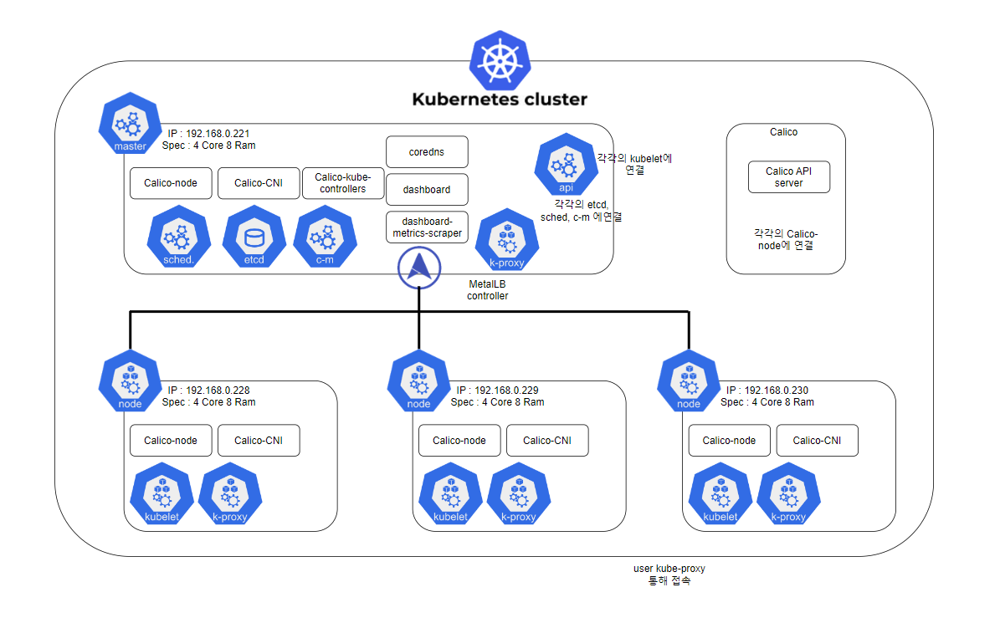
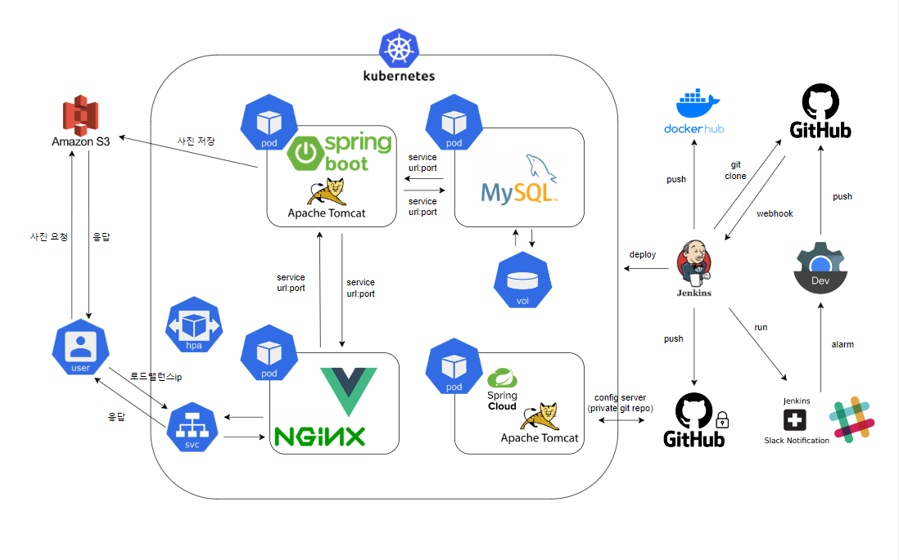

<h1 align="center">BOOKSPEDIA 데브옵스 아키텍쳐 구현</h1>

  

> [플레이 데이터] 한화시스템 BEYOND SW캠프 / HJHG..

🎬[CI/CD 시연영상](https://www.youtube.com/watch?v=dhMrKTwNI8U&lc=UgzCJR3WxkvsckRyyO94AaABAg&ab_channel=%EB%94%B0%EB%9D%BC%ED%95%98%EB%A9%B4%EC%84%9C%EB%B0%B0%EC%9A%B0%EB%8A%94IT)   
📃[프로젝트 회고록](블로그주소)

 

## 📌 프로젝트 목표

운영중인 환경에 CI/CD 적용
@@@ 
왜 ci/cd 해야하는지 간략하게

## 🖥️ 운영 환경

@@@
대시보드에서 클러스터 노드 사진 추가
	시스템 아키텍처 노드 구성
간단한 설명 hpa로 최대 몇개 까지 연결되는지 등등
로드밸런서,클러스터 ip로 이루어진부분들
	아키텍처 사진
마찬가지 간단하게

## 🔍 STACKS

&nbsp;&nbsp;

&nbsp;&nbsp;

## ✨ CI/CD 시나리오 설명

- CI : 어떤 과정을 통해 자동으로 테스트 후 결과에 따라 통합 된다는 내용 추가
- CD : 어떤 과정을 통해자동으로 운영중인 서버에 무중단 배포 된다는 내용 추가

## CI/CD 테스트 및 결과

프론트 엔드 CI/CD

<figure align="center"> 
  
    
~~~ 조회

 </figure>

## 🤼‍♂️팀원

Team : 🐯 김현균

Team : 🐺 이주현

Team : 🐱 전민재

Team : 🦁 홍현주
