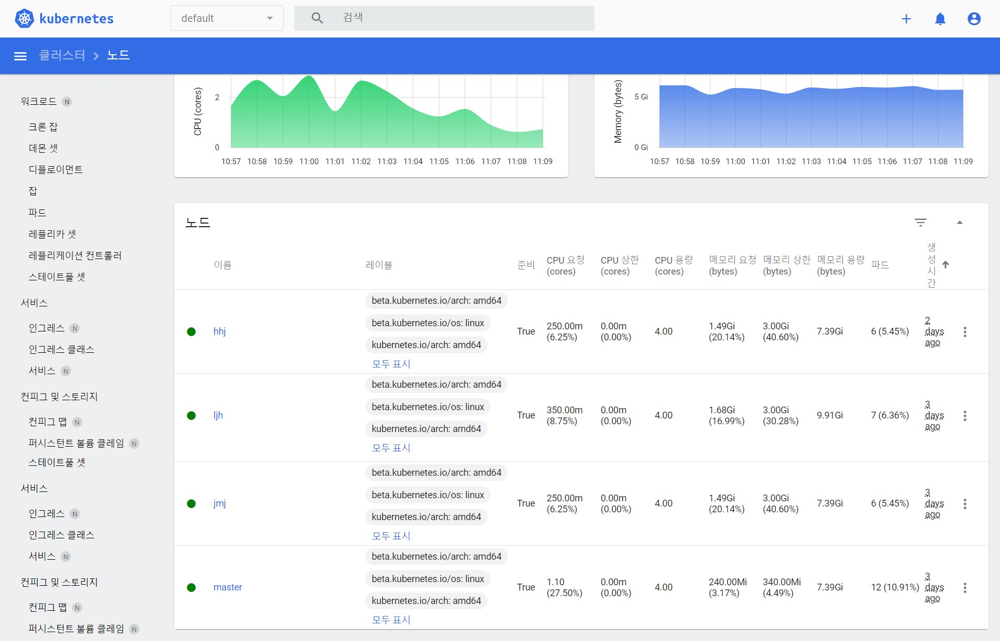
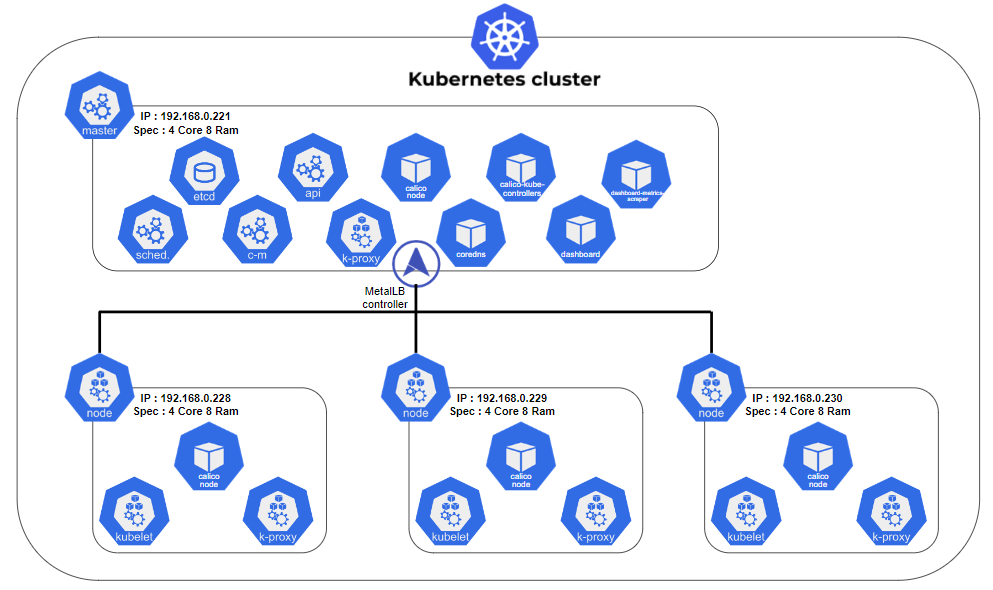
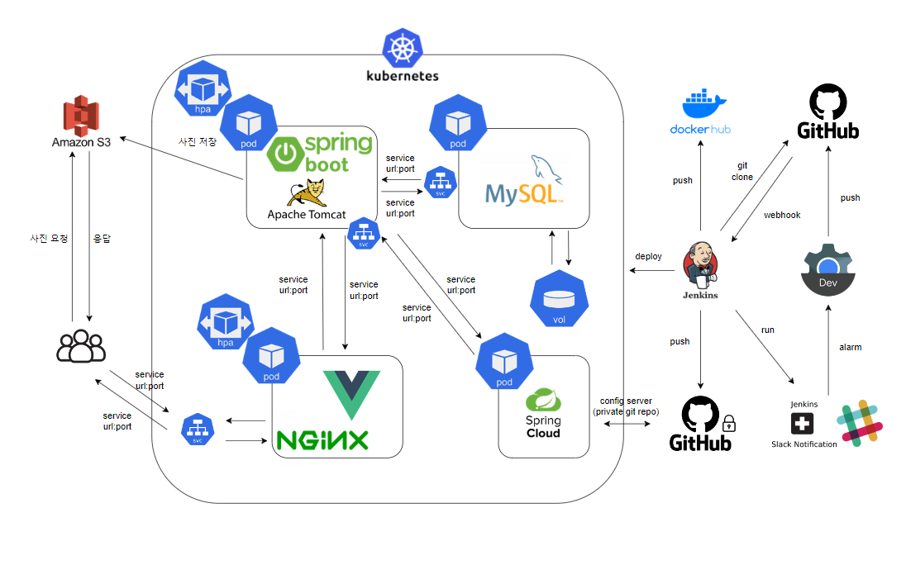

<h1 align="center">BOOKSPEDIA 데브옵스 아키텍쳐 구현</h1>

  

> [플레이 데이터] 한화시스템 BEYOND SW캠프 / HJHG..

🎬[CI/CD 시연영상](https://www.youtube.com/watch?v=dhMrKTwNI8U&lc=UgzCJR3WxkvsckRyyO94AaABAg&ab_channel=%EB%94%B0%EB%9D%BC%ED%95%98%EB%A9%B4%EC%84%9C%EB%B0%B0%EC%9A%B0%EB%8A%94IT)   
📃[프로젝트 회고록](블로그주소)

 

## 📌 프로젝트 목표

운영중인 환경에 CI/CD 적용
=> 소스 코드를 통합하는 과정에서 불필하고 반복적인 수작업(테스트 후 통합, 무중단 배포, 이전 버전 되돌리기, 생산성 향상 등)을 줄일 수 있다

## 🖥️ 운영 환경
쿠버네티스 적용 
=> 자동 로드 밸런싱을 통해 동일한 환경을 제공하여 버그를 최소화할 수 있습니다. 클러스터 내에서 자원이 자동으로 분산되어 부하를 조절하고, 모든 서비스가 안정적으로 운영되고 개발 및 배포 과정을 더욱 효율적으로 만들어 줍니다.

-  클러스터 노드 스펙

 
-  k8s 아키텍처

마스터 1대 , 워커3대로 클러스터를 구성
Calico CNI를 사용해 연결하였고 metalib를 사용해 LoadBalancing 을 하였습니다.
Rolling Update를 이용해 이전 버전과 새 버전의 파드를 점진적으로 교체하여 가용성을 유지하였습니다.

 
-  서비스 아키텍처

StatefulSet을 사용해 복체 MySQL을 사용한다.  
User는 LoadBalancer service를 통해 nginx서버를 이용한다.
pod들의 내부 통신으로 외부에 노출되지 않는다.
HPA를 사용하여 프론트와 백엔드를 스케일링하였습니다.
부하에 따라 자동으로 파드 수를 조정하며 최소2개 최대10개의 파드까지 확장될 수 있습니다.
각 파드에는 최소 1기가 메모리가 할당되고 2기가 제한을 설정했습니다.

## 🔍 STACKS

## ✨ CI/CD 시나리오 설명

- CI : 어떤 과정을 통해 자동으로 테스트 후 결과에 따라 통합 된다는 내용 추가
- CD : 어떤 과정을 통해자동으로 운영중인 서버에 무중단 배포 된다는 내용 추가

개발자가 자신의 소스코드를 버전 관리시스템(github)에 저장(push)한다.   
push가 되면, github에서 jenkins로 webhook을 전달한다.  
jenkins에서 github의 코드를 clone하고 오류를 체크한다.(shell 명령어)
테스트 코드 존재시 테스트를 실행한다. 
테스트 통과시 clone한 소스코드로 새롭게 빌드하고(백 - jar, 프론트 - dist) dockerhub에 push한다. 
slack notification을 이용하여 실패, 성공, 업데이트에 대한 내용이 알리으로 전달 된다. 
manifest 파일을 쿠버네티스 클러스터에 적용

## CI/CD 테스트 및 결과

프론트 엔드 CI/CD

<figure align="center"> 
  
    
~~~ 조회

 </figure>

## 🤼‍♂️팀원

Team : 🐯 김현균

Team : 🐺 이주현

Team : 🐱 전민재

Team : 🦁 홍현주
